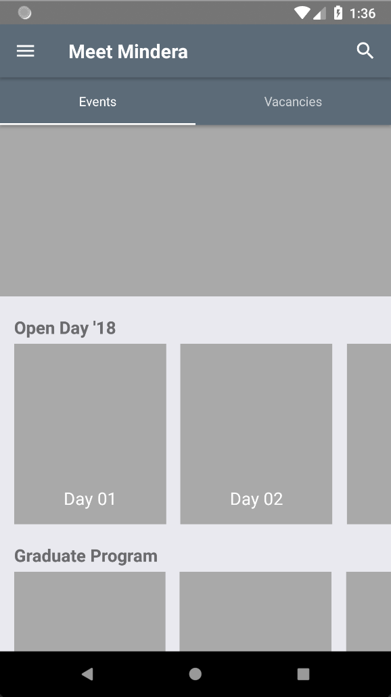

# Mindera Graduate Program

This is my proposed solution to challenge *a)* of the Mindera Graduates Program.

## *challange a)* dummy UI

This challenge consisted in:
> Implement a dummy user interface that follows the wireframe shown in this [video](https://tinyurl.com/mindera-graduates-app).
> The interface can be built using any technology/platform. For example, Android (Java or Kotlin), iOS (ObjectiveC or Swift), web-based or hybrid technologies like React, React-Native, AngularJS, Angular5, etc.

## Proposed solution

To solve this challenge I used [React Native](https://facebook.github.io/react-native/).

I have been learning React for the past few months, and this seemed like a good opportunity to better explore React and React Native.

## Getting started

See the [requirements for React Native](https://facebook.github.io/react-native/docs/getting-started.html).

1. Clone or download this repo;

2. Open the directory in terminal;

3. Install Node modules with `npm install`;

4. Configure/start your device or device emulator;

5. Run the application with `react-native run-android` or `react-native run-ios`.